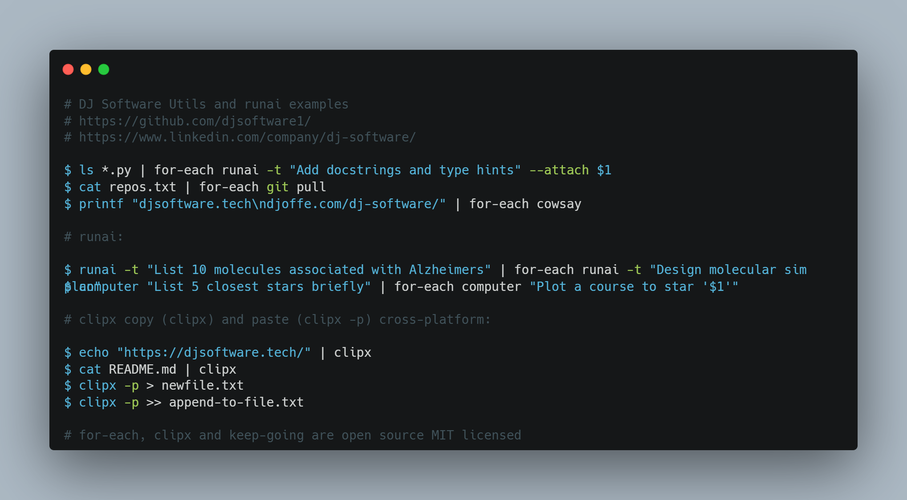

# DJ Software & Technology 🚀

We build high-performance, cross-platform software, and here make available selected utilities designed to make the terminal more powerful and AI-integrated.

## 📦 Featured Open Source or Source Available Tools

| Tool | Description | License |
| :--- | :--- | :--- |
| [**for-each**](https://github.com/djsoftware1/for-each) | Run commands per line of input with variable support. | MIT |
| [**runai**](https://github.com/djsoftware1/runai) | CLI for AI-driven development and automation. | MIT |
| [**clipx**](https://github.com/djsoftware1/clipx) | Easy cross-platform piping to/from the system clipboard. | BSL |
| [**runai-publish**](https://github.com/djsoftware1/runai-publish/) | Python library and CLI for publishing text and document sources to production-friendly output formats. | BSL |
| [**keep-going**](https://github.com/djsoftware1/keep-going) | A tiny utility for terminal morale and persistence. | MIT |



## 💡 Workflow Integration

Our tools are designed to work together following the Unix philosophy.

### Automated Documentation & Refactoring

Attach files directly to AI prompts across a whole project:

```bash
ls *.py | for-each runai -t "Add docstrings and type hints" --attach $1
```
### Agentic AI Chaining

Create multi-step AI workflows by piping `runai` or `computer` outputs into `for-each`:

```bash
# Research and Design Chain
runai -t "List 10 molecules associated with Alzheimers" | for-each runai -t "Design molecular sim"

# Data Discovery Chain
computer "List 5 closest stars briefly" | for-each computer "Plot a course to star '$1'"
```

### Clipboard Automation

Seamlessly move data between your terminal and GUI applications:

```bash
# Capture output to clipboard
cat README.md | clipx

# Use clipboard content to create files
clipx -p > newfile.txt

# For each URL on the clipboard do git clone
clipx -p | for-each git clone
```

## 📜 License

The core productivity utilities are released under the **MIT License**, while others, such as runai and runai-publish, are released under Business Source License. Contributions and feedback are always welcome!

## RunAI Studio and Molecular Sim Research Concept

[](https://djsoftware.tech/runai-studio/)

[](https://davidjoffe.github.io/research/)

## [Language Software](https://tshwanedje.com/)

Scalabe, professional tools for lexicography, terminology, corpus, translation and other language work - powering dictionary projects and language workflows across multiple contexts.

## [Chatbot/Robot Software and Framework](https://djoffe.com/dj-software/chat/)

A flexible, customisable engine for integrated AI chatbot/robot applications.

-----

[DJ Software and Technology Website](https://djsoftware.tech/) | [LinkedIn](https://www.linkedin.com/company/dj-software/), [language software](https://www.linkedin.com/company/tshwanedje)
